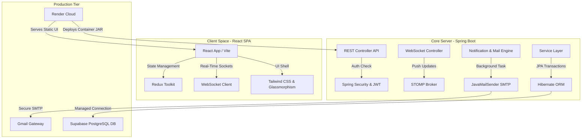

# 🚀 ProjectFlow — Premium Enterprise SaaS Collaboration Platform

ProjectFlow is a state-of-the-art, high-performance SaaS team workspace and project management platform. Combining a rich glassmorphism UI built with **React (Vite)** and a robust, highly secure backend powered by **Spring Boot (Java 17)**, ProjectFlow streamlines work assignment, real-time messaging, and multi-channel notification dispatches.

---

## 📋 Table of Contents
- [✨ Key Features](#-key-features)
- [🏗️ System Architecture](#️-system-architecture)
- [🛠️ Tech Stack](#️-tech-stack)
- [📧 Premium Email Notification Hub](#-premium-email-notification-hub)
- [📦 Render Deployment Guide (One-Click Blueprint)](#-render-deployment-guide-one-click-blueprint)
- [💻 Local Setup & Development](#-local-setup--development)
- [🔒 Production Security Guidelines](#-production-security-guidelines)
- [🤝 Contributing & Git Workflow](#-contributing--git-workflow)

---

## ✨ Key Features

### 📊 Dynamic Glassmorphism Dashboard
- Real-time team analytics, project budget monitoring, and operational velocity trackers.
- Premium interactive UI elements with subtle micro-animations and cohesive dark-mode visual patterns.

### 🗂️ Enterprise Project & Task Management
- Detailed task allocation, priority settings, custom target deadlines, and progress checkpoints.
- Strict JPA check constraints to prevent database inconsistencies and preserve transactional integrity.

### 💬 Real-Time Collaboration & Messaging
- WebSocket-enabled group channels and secure direct peer-to-peer chat systems.
- Dynamic user presence alerts and live typing telemetry.

### 📧 SMTP Email Notification Sandbox
- Automated notification dispatches triggered by task assignments, checklist modifications, and message logs.
- Visual HTML templates with curated typography (Outfit/Inter) and direct mock-recipient email redirects to developer mailboxes for active sandbox testing.
- Live administrative delivery logs, SMTP status diagnostics, and manual composing dashboard.

---

## 🏗️ System Architecture



---

## 🛠️ Tech Stack

| Layer | Technologies Used | Key Purpose |
| :--- | :--- | :--- |
| **Frontend** | React 18, Vite, Redux Toolkit, Tailwind CSS, Lucide Icons, STOMP | Hyper-fast responsive UI, global state management, visual excellence. |
| **Backend** | Spring Boot 3.x, Spring Security, JWT, JavaMailSender, WebSocket | Scalable API orchestration, secure user authentication, background jobs. |
| **Database** | Supabase PostgreSQL, Hibernate JPA | Enterprise-grade relational storage, strict check constraints. |
| **Deployment** | Render Blueprint (`render.yaml`), Nginx, Docker | Automated cloud deployment, zero-downtime static compilation. |

---

## 📧 Premium Email Notification Hub

The platform features a fully integrated **Gmail SMTP server** configuration that sends beautifully styled HTML notifications using `@Async` non-blocking workers:

1. **Automated Event Triggers**: 
   - `TASK_ASSIGNED`: Sent to an employee when a new task is allocated.
   - `TASK_UPDATED`: Dispatched when budgets, descriptions, or deadlines are modified.
   - `COMMENT_ADDED`: Alerts task owners when a peer adds a comment or review.
2. **Outfit/Inter Styling Engine**: Core HTML e-mails are built dynamically with custom-tailored CSS containing soft drop-shadows, modern visual badges, and responsive tables.
3. **Local Developer Redirect Rules**: In-development mock profiles (e.g. `*@example.com`) are automatically intercepted and securely redirected to the primary testing mailbox (`dreammasterorigin@gmail.com`) to prevent spamming inactive domains.
4. **Interactive Email Page UI**: Includes an active SMTP status card, live database-backed log grids, HTML payload preview drawers, and custom scenario testing sandboxes.

---

## 📦 Render Deployment Guide (One-Click Blueprint)

The repository includes a ready-to-run [render.yaml](file:///e:/SAAS_platform/render.yaml) blueprint configuration.

### Deployment Architecture
Render automatically structures two linked services based on the blueprint:
1. **`projectflow-backend` (Web Service)**: Automatically builds the Spring Boot project using Maven, compiles a standalone fat JAR, and runs it on the JVM environment.
2. **`projectflow-frontend` (Static Web Service)**: Downloads dependencies via `npm`, compiles production React assets to `dist/`, and publishes the static distribution via Render's CDN. It automatically binds to the live backend service dynamically via the `VITE_API_URL` environment binding.

### How to Deploy
1. Push your updated code to your GitHub repository: `https://github.com/Bhavyanth/Saas_team_workspace`.
2. Open the [Render Dashboard](https://dashboard.render.com).
3. Click **New +** and select **Blueprint**.
4. Connect your GitHub repository.
5. Review the service configurations loaded from `render.yaml` and click **Approve / Deploy**.

---

## 💻 Local Setup & Development

### Database Setup
1. Obtain your Supabase PostgreSQL credentials.
2. The schema will be auto-generated by Hibernate (`spring.jpa.hibernate.ddl-auto: update`) on your first startup.

### Running Backend Locally
Ensure you have **Java 17** and **Maven** installed:
```bash
cd SAAS_platform/backend
# Build and package the project
mvn clean compile
# Run the Spring Boot application
mvn spring-boot:run
```
The server will start on `http://localhost:8080`.

### Running Frontend Locally
Ensure you have **Node.js** installed:
```bash
cd SAAS_platform/frontend
# Install required dependencies
npm install
# Start the Vite development server
npm run dev
```
Open `http://localhost:5173` to interact with the application.

---

## 🔒 Production Security Guidelines

> [!WARNING]
> The current [render.yaml](file:///e:/SAAS_platform/render.yaml) file contains explicit connection properties and SMTP tokens to facilitate immediate testing. If you make this GitHub repository **public**, follow these instructions immediately:

1. **Move Secrets to Render Dashboard**: Edit the `render.yaml` or go to the Render Dashboard, open your web services settings, and move these variables to the **Secret Files** or dashboard **Environment Variables**:
   - `SPRING_DATASOURCE_PASSWORD`
   - `SPRING_MAIL_PASSWORD` (App Password)
   - `JWT_SECRET`
2. **Commit Placeholder Values**: Replace actual passwords inside the git-tracked `render.yaml` with placeholder references (e.g. `placeholder-db-pwd`) or remove them to pull them dynamically from Render's cloud environment.

---

## 🤝 Contributing & Git Workflow

### Crucial Git Precaution (Nested Repository Fix)
Because the codebase is contained inside the `SAAS_platform` subfolder which contains its own historical `.git` folder, you must execute the following commands to ensure Git commits the actual code directories rather than treating them as empty git submodules:

```powershell
# 1. Clean nested repository settings (run from root e:\SAAS_platform)
Remove-Item -Recurve -Force SAAS_platform\.git

# 2. Stage all modifications (including the main codebases)
git add .

# 3. Commit changes
git commit -m "feat: integrate premium SMTP email hub, render deployment blueprints, and root documentation"

# 4. Push to remote
git push origin master
```

Developed with ❤️ by the ProjectFlow Engineering Team.
